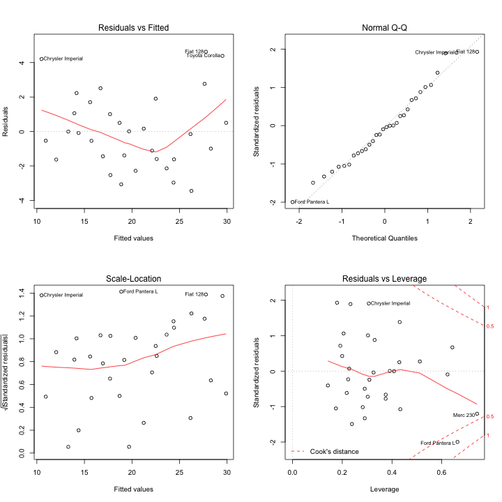
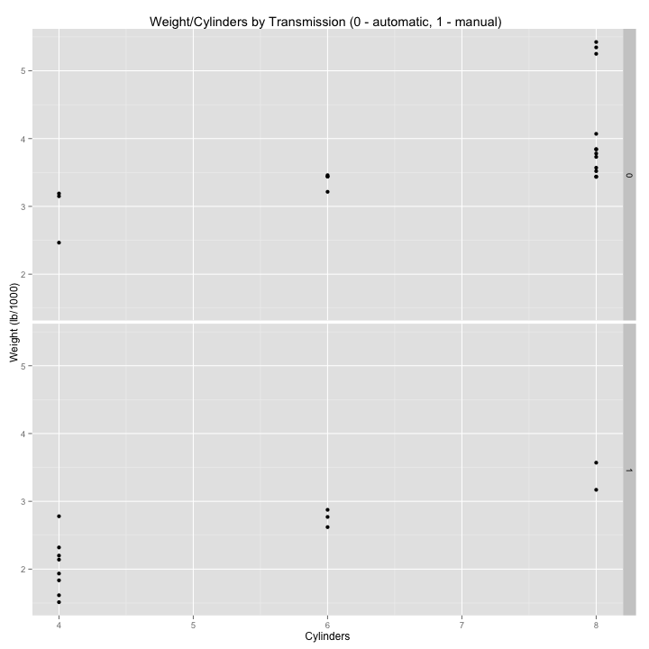

### Executive Summary
The questions posed are:

- “Is an automatic or manual transmission better for MPG”
- "Quantify the MPG difference between automatic and manual transmissions"

Throught analysis I have found that whilst manual transmission did appear to have a positive impact on MPG it wasn't the full story as weight and clyinders were the most statistically significant variables and the sample (appendix 4) showed that the manual cars tended to be lighter with less cylinders and there appear more fuel efficient but transmission would need to be further testing.

### Data Processing

#### Set global settings
Ensuring that the correct library is loaded for knitr and setting the global chunk options(note that I do set the working directory but have not included that line for privacy):

```r
library(knitr)     
library(ggplot2)
library(datasets)
library(markdown)

opts_chunk$set(warning = FALSE, message = FALSE, echo = TRUE, cache = TRUE, 
               fig.width = 10, fig.height = 10)
```
Note that the `echo = FALSE` parameter was added to the code chunk to prevent printing of the R code that generated the plot.  `warning = FALSE` and `message = FALSE` are added to remove the uncessary warnings and messages when producing the plots.  Finally added `fig.width/height = 10` to make the plots wider and easier to read; for this exercise I have also added `cache = TRUE` to help reduce the runtimes.

### Regression Analysis

#### Regression model to test transmission against MPG

The use of a boxplot is a great visual tool to understand the relationships in the data and from this one we can see that there is relationship between tranmission and MPG; with manual transmissions getting more fuel efficiency.

```r
# The library is one of the demo one's from R-Studio, first thing I do is boxplot the transmission against MPG
boxplot(mpg ~ am, data = mtcars, main = "Tranmission vs. MPG", xlab = "Transmission (0 = automatic, 1 = manual)", ylab="MPG")
```

 

I want to better quantify this position so I construct a simple regression model with transmission as predictor (1 as manual and 0 as automatic) and MPG as the outcome.

```r
mtcarsmodel1 <- lm(mpg ~ am, data = mtcars)
summary(mtcarsmodel1)
```

```
## 
## Call:
## lm(formula = mpg ~ am, data = mtcars)
## 
## Residuals:
##    Min     1Q Median     3Q    Max 
## -9.392 -3.092 -0.297  3.244  9.508 
## 
## Coefficients:
##             Estimate Std. Error t value Pr(>|t|)    
## (Intercept)    17.15       1.12   15.25  1.1e-15 ***
## am              7.24       1.76    4.11  0.00029 ***
## ---
## Signif. codes:  0 '***' 0.001 '**' 0.01 '*' 0.05 '.' 0.1 ' ' 1
## 
## Residual standard error: 4.9 on 30 degrees of freedom
## Multiple R-squared:  0.36,	Adjusted R-squared:  0.338 
## F-statistic: 16.9 on 1 and 30 DF,  p-value: 0.000285
```
Transmission accounts for 36% of the variance (so still a lot of factors in play) in fuel consumption, which is statistically significantly better than chance (p < .0003).  The intercept shows the baseline MPG of 17.15 miles per gallon and the coefficients shows a 7.24 increase where the transmission is manual.  These would be better expressed as 95% Confidence Intervals using a *t* test.

```r
attach(mtcars)
```

```
## The following object is masked from package:ggplot2:
## 
##     mpg
## The following objects are masked from mtcars (position 6):
## 
##     am, carb, cyl, disp, drat, gear, hp, mpg, qsec, vs, wt
```

```r
y1 <- mpg[am == 0]
y2 <- mpg[am == 1]
x1 <- t.test(y1, mu = 0)
x2 <- t.test(y2, mu = 0)
x1$conf.int
```

```
## [1] 15.3 19.0
## attr(,"conf.level")
## [1] 0.95
```

```r
x2$conf.int
```

```
## [1] 20.67 28.12
## attr(,"conf.level")
## [1] 0.95
```
So we can see that the 95% CI for automatic is (15.3, 19.0), and for manual is (20.67, 28.12) therefore showing that manual does deliver better fuel economy, however we do need to look at the other data to understand the overall effects.

#### Regression model to test the other variables

The first thing that I am checking is the analysis of variance across all the variables.  

```r
analysis <- aov(mpg ~ ., data = mtcars)
summary(analysis)
```

```
##             Df Sum Sq Mean Sq F value Pr(>F)    
## cyl          1    818     818  116.42  5e-10 ***
## disp         1     38      38    5.35 0.0309 *  
## hp           1      9       9    1.33 0.2610    
## drat         1     16      16    2.34 0.1406    
## wt           1     77      77   11.03 0.0032 ** 
## qsec         1      4       4    0.56 0.4617    
## vs           1      0       0    0.02 0.8932    
## am           1     14      14    2.06 0.1659    
## gear         1      1       1    0.14 0.7137    
## carb         1      0       0    0.06 0.8122    
## Residuals   21    147       7                   
## ---
## Signif. codes:  0 '***' 0.001 '**' 0.01 '*' 0.05 '.' 0.1 ' ' 1
```
So if the p-value is very low, then there is a higher probability that we are seeing data that is counter-indicative of zero effect i.e. having an effect. With this in mind I will look more into cyl (no. cylinders), disp (displacement) and wt (weight) - still retaining am given its our focus.

Appendix 3 also shows us that we have little fear of heteroscedascity, we see normality of residuals and also the residuals increase with the fitted values (which is normal).


```r
lm <- lm(mpg ~ cyl + disp + wt + am, data = mtcars)
summary(lm)
```

```
## 
## Call:
## lm(formula = mpg ~ cyl + disp + wt + am, data = mtcars)
## 
## Residuals:
##    Min     1Q Median     3Q    Max 
## -4.318 -1.362 -0.479  1.354  6.058 
## 
## Coefficients:
##             Estimate Std. Error t value Pr(>|t|)    
## (Intercept)  40.8983     3.6015   11.36  8.7e-12 ***
## cyl          -1.7842     0.6182   -2.89   0.0076 ** 
## disp          0.0074     0.0121    0.61   0.5451    
## wt           -3.5834     1.1865   -3.02   0.0055 ** 
## am            0.1291     1.3215    0.10   0.9229    
## ---
## Signif. codes:  0 '***' 0.001 '**' 0.01 '*' 0.05 '.' 0.1 ' ' 1
## 
## Residual standard error: 2.64 on 27 degrees of freedom
## Multiple R-squared:  0.833,	Adjusted R-squared:  0.808 
## F-statistic: 33.6 on 4 and 27 DF,  p-value: 4.04e-10
```
At this point we can see the high p-value indicates that transmission (in this model) has a high probability of 0 effect, now I want to see the effects with transmission removed - I also remove disp given its high p-value too.


```r
lm <- lm(mpg ~ cyl + wt, data = mtcars)
summary(lm)
```

```
## 
## Call:
## lm(formula = mpg ~ cyl + wt, data = mtcars)
## 
## Residuals:
##    Min     1Q Median     3Q    Max 
## -4.289 -1.551 -0.468  1.574  6.100 
## 
## Coefficients:
##             Estimate Std. Error t value Pr(>|t|)    
## (Intercept)   39.686      1.715   23.14  < 2e-16 ***
## cyl           -1.508      0.415   -3.64  0.00106 ** 
## wt            -3.191      0.757   -4.22  0.00022 ***
## ---
## Signif. codes:  0 '***' 0.001 '**' 0.01 '*' 0.05 '.' 0.1 ' ' 1
## 
## Residual standard error: 2.57 on 29 degrees of freedom
## Multiple R-squared:  0.83,	Adjusted R-squared:  0.819 
## F-statistic: 70.9 on 2 and 29 DF,  p-value: 6.81e-12
```

So in conclusion, cylinders and weight seem to be the biggest influece on MPG but how come we saw such a dramatic impact of transmission at the start?  The final check I have done is in Appendix 4 to better understand the types of car we are looking at.  What we see is that, in our sample, the automatic cards tend to be heavier and have more cylinders and the manuals are lighter and less cylinders, therefore, given our last model we would expect manuals to see better MPG so there is more at play here than simply transmission and would need to test equitable samples to discover more.

### Appendices

#### Appendix 1 - Raw data

```r
mtcars
```

```
##                      mpg cyl  disp  hp drat    wt  qsec vs am gear carb
## Mazda RX4           21.0   6 160.0 110 3.90 2.620 16.46  0  1    4    4
## Mazda RX4 Wag       21.0   6 160.0 110 3.90 2.875 17.02  0  1    4    4
## Datsun 710          22.8   4 108.0  93 3.85 2.320 18.61  1  1    4    1
## Hornet 4 Drive      21.4   6 258.0 110 3.08 3.215 19.44  1  0    3    1
## Hornet Sportabout   18.7   8 360.0 175 3.15 3.440 17.02  0  0    3    2
## Valiant             18.1   6 225.0 105 2.76 3.460 20.22  1  0    3    1
## Duster 360          14.3   8 360.0 245 3.21 3.570 15.84  0  0    3    4
## Merc 240D           24.4   4 146.7  62 3.69 3.190 20.00  1  0    4    2
## Merc 230            22.8   4 140.8  95 3.92 3.150 22.90  1  0    4    2
## Merc 280            19.2   6 167.6 123 3.92 3.440 18.30  1  0    4    4
## Merc 280C           17.8   6 167.6 123 3.92 3.440 18.90  1  0    4    4
## Merc 450SE          16.4   8 275.8 180 3.07 4.070 17.40  0  0    3    3
## Merc 450SL          17.3   8 275.8 180 3.07 3.730 17.60  0  0    3    3
## Merc 450SLC         15.2   8 275.8 180 3.07 3.780 18.00  0  0    3    3
## Cadillac Fleetwood  10.4   8 472.0 205 2.93 5.250 17.98  0  0    3    4
## Lincoln Continental 10.4   8 460.0 215 3.00 5.424 17.82  0  0    3    4
## Chrysler Imperial   14.7   8 440.0 230 3.23 5.345 17.42  0  0    3    4
## Fiat 128            32.4   4  78.7  66 4.08 2.200 19.47  1  1    4    1
## Honda Civic         30.4   4  75.7  52 4.93 1.615 18.52  1  1    4    2
## Toyota Corolla      33.9   4  71.1  65 4.22 1.835 19.90  1  1    4    1
## Toyota Corona       21.5   4 120.1  97 3.70 2.465 20.01  1  0    3    1
## Dodge Challenger    15.5   8 318.0 150 2.76 3.520 16.87  0  0    3    2
## AMC Javelin         15.2   8 304.0 150 3.15 3.435 17.30  0  0    3    2
## Camaro Z28          13.3   8 350.0 245 3.73 3.840 15.41  0  0    3    4
## Pontiac Firebird    19.2   8 400.0 175 3.08 3.845 17.05  0  0    3    2
## Fiat X1-9           27.3   4  79.0  66 4.08 1.935 18.90  1  1    4    1
## Porsche 914-2       26.0   4 120.3  91 4.43 2.140 16.70  0  1    5    2
## Lotus Europa        30.4   4  95.1 113 3.77 1.513 16.90  1  1    5    2
## Ford Pantera L      15.8   8 351.0 264 4.22 3.170 14.50  0  1    5    4
## Ferrari Dino        19.7   6 145.0 175 3.62 2.770 15.50  0  1    5    6
## Maserati Bora       15.0   8 301.0 335 3.54 3.570 14.60  0  1    5    8
## Volvo 142E          21.4   4 121.0 109 4.11 2.780 18.60  1  1    4    2
```

#### Appendix 2 - Bivariate plots of variables

```r
pairs(mtcars)
```

 

#### Appendix 3 - Model diagnostics

```r
par(mfrow = c(2, 2))
plot(analysis)
```

 

#### Appendix 4 - Understanding the cars

```r
qplot(cyl, wt, data=mtcars, main="Weight/Cylinders by Transmission (0 - automatic, 1 - manual) ", xlab = "Cylinders", ylab = "Weight (lb/1000)") +
  facet_grid(am ~ .)
```

 

##### ScubaSteve22. August 2014.
